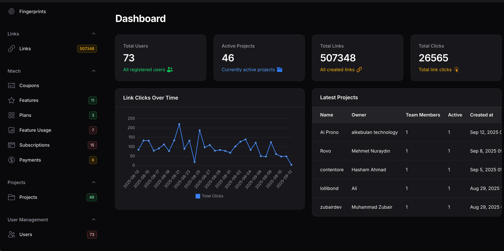
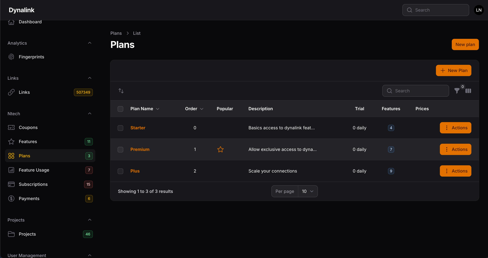
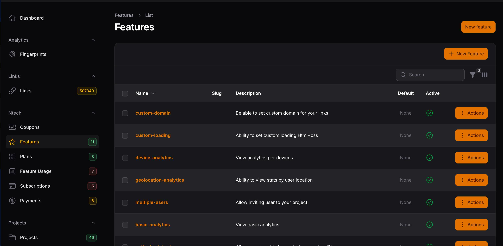
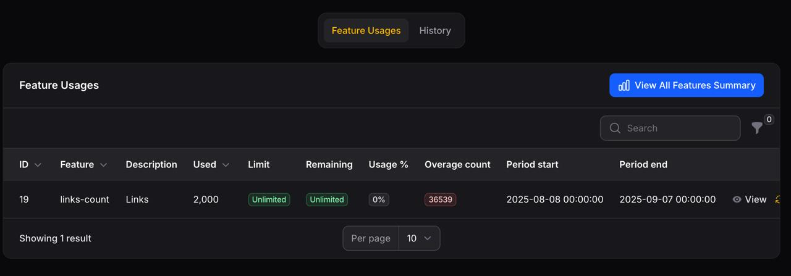
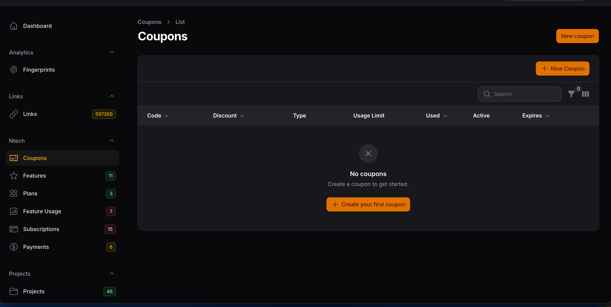

# Subscription System Admin

[](https://packagist.org/packages/ntech-services/subscription-system-admin)
[](https://github.com/ntech-services/subscription-system-admin/actions?query=workflow%3Arun-tests+branch%3Amain)
[](https://github.com/ntech-services/subscription-system-admin/actions?query=workflow%3A"Fix+PHP+code+styling"+branch%3Amain)
[](https://packagist.org/packages/ntech-services/subscription-system-admin)

<div align="center">
     
     <h1>Subscription System Admin</h1>
   </div>
A comprehensive Laravel package that provides a complete subscription system administration interface for Filament admin panels. This package allows you to manage subscriptions, plans, features, usage tracking, and coupons with a beautiful and intuitive admin interface.

Perfect for SaaS applications, membership sites, or any Laravel project that needs subscription management capabilities. The package integrates seamlessly with Filament's admin panel and provides both API and web routes for maximum flexibility.

## Screenshots

### Dashboard Overview

*Main dashboard showing subscription metrics and key statistics*

### Plan Management

*Intuitive interface for creating and managing subscription plans*

### Feature Configuration

*Configure plan features, limits, and pricing overrides*

### Subscription Details

*Detailed view of individual subscriptions with usage tracking*

### Coupon Management

*Create and manage discount coupons and promotional codes*

## Features

- 📊 **Subscription Management** - Complete CRUD operations for subscriptions
- 💳 **Plan Management** - Create and manage subscription plans with different tiers
- ⚡ **Feature Usage Tracking** - Monitor and limit feature usage per subscription
- 🎟️ **Coupon System** - Create and manage discount coupons
- 🔌 **API & Web Routes** - Flexible routing options for different use cases
- 🌍 **Multi-language Support** - Easily translatable interface
- 🎨 **Filament Integration** - Beautiful admin interface with Filament components
- ⚙️ **Configurable** - Highly customizable through configuration files

## Requirements

- PHP 8.1 or higher
- Laravel 10.0 or higher
- Filament 4.x

## Installation

### Step 1: Install Filament (if not already installed)

If you don't have Filament installed yet, follow the documentation here: https://filamentphp.com/docs/4.x/introduction/installation#installing-the-panel-builder

### Step 2: Install the Package

You can install the package via Composer:

```bash
composer require ntech-services/subscription-system-admin
```

### Step 3: Run Migrations

Run this command to install the subscription system tables:

```bash
php artisan migrate:subscription-system
```

### Step 4: Configure the Plugin

In your `AdminPanelProvider`, add the plugin:

```php
use NtechServices\SubscriptionSystemAdmin\SubscriptionSystemAdminPlugin;

public function panel(Panel $panel): Panel
{
    return $panel
        // ... other configuration
        ->plugins([
            SubscriptionSystemAdminPlugin::make()
                ->subscriptionFeatureUsage(false) // Optional: disable feature usage
                ->coupons(true) // Optional: enable coupons
        ]);
}
```

### Step 5: Publish Configuration (Optional)

You can publish and customize the configuration file:

```bash
php artisan vendor:publish --tag="subscription-system-admin-config"
```

### Step 6: Run Additional Migrations

After publishing the config, run the standard migrations:

```bash
php artisan migrate
```

## Configuration

You can publish the config file to customize the package behavior:

```bash
php artisan vendor:publish --tag="subscription-system-admin-config"
```

This is the contents of the published config file:

```php
<?php

return [
    // Enable or disable API routes
    'enable_api_routes' => true,
    
    // Enable or disable web routes
    'enable_web_routes' => false,
    
    // API routes prefix
    'api_prefix' => 'api/ntech-subscription',
    
    // Web routes prefix
    'web_prefix' => 'ntech-subscription',
    
    // Middleware for API routes
    'api_middleware' => ['api'],
    
    // Middleware for web routes
    'web_middleware' => ['web', 'auth'],
];
```

## Publishing Assets

### Publish Views

You can publish and customize the views:

```bash
php artisan vendor:publish --tag="subscription-system-admin-views"
```

### Publish Migrations

You can publish the migration files to customize them:

```bash
php artisan vendor:publish --tag="subscription-system-admin-migrations"
```

### Publish Translations

To add new languages or customize existing translations:

```bash
php artisan vendor:publish --tag="subscription-system-admin-lang"
```

## Usage

### Plugin Configuration

The primary way to use this package is through the Filament plugin configuration:

```php
use NtechServices\SubscriptionSystemAdmin\SubscriptionSystemAdminPlugin;

// In your AdminPanelProvider
SubscriptionSystemAdminPlugin::make()
    ->subscriptionFeatureUsage(true)  // Enable/disable feature usage tracking
    ->coupons(true)                   // Enable/disable coupon system
```

### API Integration

The package automatically registers API routes that you can consume in your frontend applications or mobile apps. All endpoints return structured JSON responses with consistent formatting.

### Plugin Configuration Options

The plugin provides several configuration methods:

```php
SubscriptionSystemAdminPlugin::make()
    ->subscriptionFeatureUsage(true)  // Enable/disable feature usage tracking
    ->coupons(true)                   // Enable/disable coupon system
    ->apiRoutes(true)                 // Enable/disable API routes
    ->webRoutes(false)                // Enable/disable web routes
```

### API Routes

When API routes are enabled, you can access the subscription system via REST API. The package provides the following endpoints:

#### Available Routes

- `GET /plans` - List all subscription plans ([PlanController::class, 'index'])
- `GET /plans/{plan}` - Get a specific plan ([PlanController::class, 'show'])  
- `GET /plans/{plan}/features` - Get plan features ([PlanController::class, 'features'])

#### Full URLs (with default prefix)

- `GET /api/ntech-subscription/plans`
- `GET /api/ntech-subscription/plans/{plan}`
- `GET /api/ntech-subscription/plans/{plan}/features`

#### API Response Structure

**List Plans Response (`GET /plans`):**
```json
{
  "success": true,
  "data": [
    {
      "id": 1,
      "name": "Basic Plan",
      "slug": "basic-plan",
      "description": "Perfect for getting started",
      "order": 1,
      "popular": false,
      "trial_value": 7,
      "trial_cycle": "days",
      "features": [
        {
          "id": 1,
          "name": "API Calls",
          "slug": "api-calls",
          "description": "Monthly API call limit",
          "value": "1000",
          "is_soft_limit": true,
          "overage_price": "0.01",
          "overage_currency": "USD"
        }
      ],
      "prices": [
        {
          "id": 1,
          "price": "9.99",
          "currency": "USD",
          "billing_cycle": "monthly",
          "is_active": true,
          "feature_overrides": []
        }
      ]
    }
  ]
}
```

**Plan Features with Overrides (`GET /plans/{plan}/features`):**
This endpoint provides a merged view of plan features with price-specific overrides applied, showing the final values that would be used for each billing cycle.

#### Authentication & Middleware

API routes use the middleware defined in your configuration (default: `['api']`). For production use, you should add authentication middleware:

```php
// In your config file
'api_middleware' => ['api', 'auth:sanctum'], // or 'auth:api'
```

### Web Routes

When web routes are enabled, you can access the subscription system via web interface at the configured prefix.

## Advanced Usage & Custom Queries

This package builds on top of the core [ntech-services/subscription-system](https://packagist.org/packages/ntech-services/subscription-system) package. For advanced usage, custom queries, and direct model manipulation, please refer to the underlying package documentation.

### Custom Model Queries

You can directly use the underlying models for custom queries:

```php
use NtechServices\SubscriptionSystem\Models\Plan;
use NtechServices\SubscriptionSystem\Models\Feature;
use NtechServices\SubscriptionSystem\Models\Subscription;

// Get all active plans with their features
$activePlans = Plan::with(['features', 'planPrices' => function($query) {
    $query->where('is_active', true);
}])->get();

// Get subscription usage for a specific feature
$usage = Subscription::with(['usages' => function($query) use ($featureId) {
    $query->where('feature_id', $featureId);
}])->find($subscriptionId);
```

### Extending Functionality

For comprehensive documentation on models, relationships, and advanced queries, visit: https://packagist.org/packages/ntech-services/subscription-system

## Managing Subscriptions

The package provides a complete admin interface through Filament where you can:

1. **Create and manage subscription plans** with different features and pricing
2. **Monitor active subscriptions** and their usage
3. **Track feature usage** per subscription to enforce limits
4. **Create and manage coupons** for discounts and promotions
5. **Generate reports** on subscription metrics

## Customization

### Custom Models

You can extend the default models by publishing them and modifying as needed. The package is designed to be flexible and allows for extensive customization.

### Custom Views

Publish the views and modify them to match your application's design:

```bash
php artisan vendor:publish --tag="subscription-system-admin-views"
```

### Custom Translations

Add support for additional languages by publishing and modifying the language files:

```bash
php artisan vendor:publish --tag="subscription-system-admin-lang"
```

## Testing

Run the test suite:

```bash
composer test
```

## Changelog

Please see [CHANGELOG](CHANGELOG.md) for more information on what has changed recently.

## Contributing

Please see [CONTRIBUTING](.github/CONTRIBUTING.md) for details.

## Security Vulnerabilities

Please review [our security policy](../../security/policy) on how to report security vulnerabilities.

## Credits

- [Loic NGOU](https://github.com/loicgeek)
- [All Contributors](../../contributors)

## License

The MIT License (MIT). Please see [License File](LICENSE.md) for more information.

## Support

If you encounter any issues or have questions, please:

1. Check the [documentation](https://github.com/ntech-services/subscription-system-admin)
2. Search existing [issues](https://github.com/ntech-services/subscription-system-admin/issues)
3. Create a new issue if your problem isn't already reported

For commercial support or custom development, please contact [Loic NGOU](https://github.com/loicgeek).